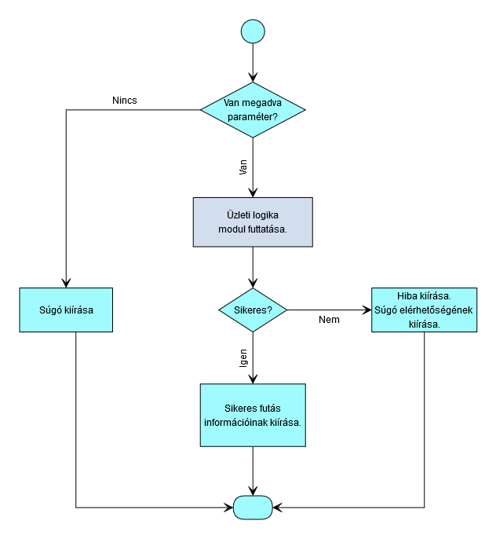
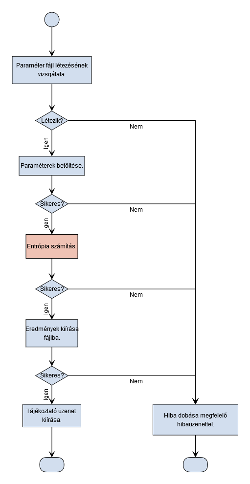
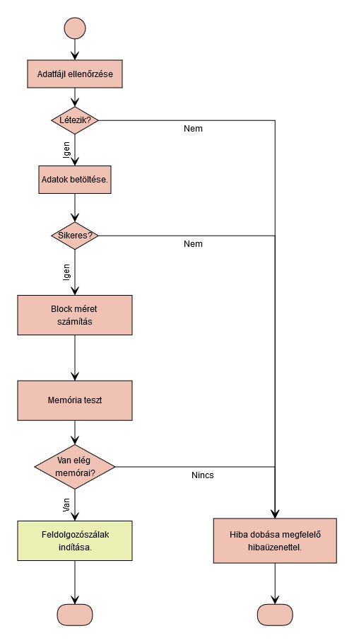
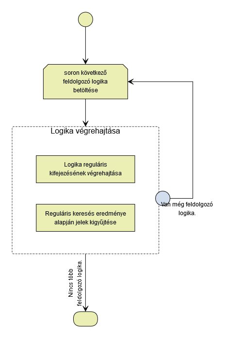
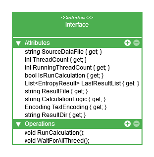
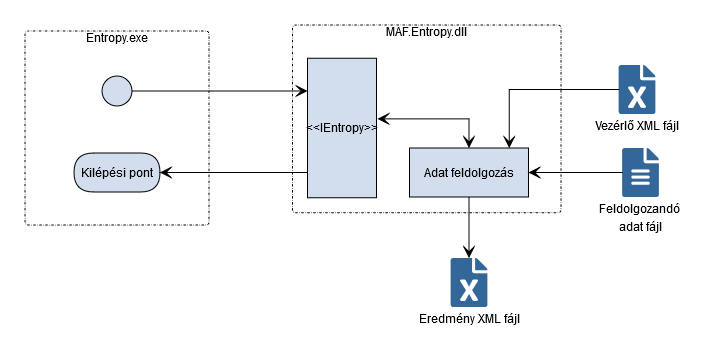

# Projekt tervek
A fejlesztést minden része C# nyelven lesz megvalósítva.  
A felületet egy konzolos alkalmazás, az üzleti logikát egy dinamikus csatolású könyvtár valósítja meg.  
A feldolgozás paraméterezése egy XML fájlba van. Ennek felépítése a "Vezérlő XML fájl" fejezetnél található. Reguláris kifejezéseket tartalmaz, amik megmondják, hogy mit tekintünk jelnek. Az így meghatározott jelekből lesz kiszámolva az entrópia.  
Az eredményt szintén XML fájlba teszi. Ennek felépítése az "Eredmény XML fájl" fejezetnél található.  
A feldolgozás sebességre optimalizált. 

## Felület terv
A felületet paraméterek nélkül indítva kiírja a program súgóját.  
Paraméterrel indítva megvizsgálja, hogy a paraméter létező szöveges fájlra mutat-e. Amennyiben igen, akkor elindítja az entrópia számítást a paraméterben kapott szöveges fájlra. A futás végén tájékoztató üzenetet ír ki a konzol ablakra. Amennyiben nem létezik a paraméterben megadott fájl, akkor a megfelelő hibaüzenettel és a súgó elérhetőségének kiírásával leáll a program.

A felület állapotgép diagramja:  

## Üzleti logika terv
A teljes üzleti logika a DLL-ben van megvalósítva.  
Az entrópia számításban paraméterezhető, hogy mit tekintünk jelnek. Több jelkészlet feldolgozására is alkalmas kell legyen a program.  
Sebességre optimalizálás érdekében, ha a futtató hardver környezet képes több szálat is kezelni, akkor maximum az össz szál mínusz egy szálon indíthatja meg a feldolgozást. Ha a szöveges állomány mérete túl kicsi, 64 kbyte alatt van, akkor nem bontja több szálra a futást. 

A feldolgozás állapotgép diagramja:  
 

A feldolgozás alábontása:  
 

A memóriavizsgálat azt hivatott ellenőrizni, hogy van-e elég memória a teljes adatállomány betöltéséhez. A program nem engedi meg a teljes memória lefoglalását, a limit 65%-nál van meghúzva. 
A block méret számítás dönt arról, hogy az egyes szálak mekkora adattömböt kapnak feldolgozásra.

A szálak belső működésének diagramja:    

A jelkészletet nem felsorolással adjuk meg, hanem szabállyal. A szabály leírására reguláris kifejezést használunk. Az, hogy mit tekintünk jelnek, a jelkészlet táblázat tartalmazza. 

Jelkészlet táblázat:
| Logika neve        | Jel meghatározása                                  | Meghatározás paramétere | Kisbetűre alakítás | Trim   | Lehet-e üres jel | 
|--------------------|----------------------------------------------------|-------------------------|--------------------|--------|------------------| 
| Minden karakter    | .                                                  |                         |                    |        |                  | 
| Szóközök nélkül    | \\S                                                |                         |                    |        |                  | 
| Csak alfanumerikus | \\w                                                |                         |                    |        |                  | 
| Csak numerikus     | \\d                                                |                         |                    |        |                  | 
| Csak betűk         | \[^\\d\\W\]                                        |                         |                    |        |                  | 
| Csak írásjelek     | \[^\\d\\w \]                                       |                         |                    |        |                  | 
| Szavak             | \\w+                                               | IgnoreCase              | igen               |        |                  | 
| Mondatok           | (\.\.\.\|\[úu\]n\.\|pl\.\|.\*?)+(\.\|\?\|!\|$)     | IgnoreCase              | igen               | szóköz | nem              | 

A megadott jelkészlet szabályok alapján kigyűjtjük a jeleket a szövegből és ez fogja képezni az entrópia számítás alapját. Adott lesz az összes jelek száma és az egyes jelek előfordulásainak száma. Az eredmény kiírásakor fontos lesz ezeknek az adatoknak a kiírása is, hogy értelmezhető legyen az eredmény.

### Üzleti logika interfésze

## Vezérlő XML fájl
Fájl neve: ecl.xml  
Fájl típusa: XML  
Fájl helye: program könyvtár \Logic mappa.  
Fájl karakterkódolása: UTF-8  
Fájl szerkezete: [ecl_minta.xml](ecl_minta.xml)

## Eredmény XML fájl
Fájl neve: a fájl neve az eredeti feldolgozandó fájlneve aminek a végére egy dátumidő lesz fűzve, a következő formátumban: _YYYY_MM_DD_hh_mm_ss. A fájl kiterjesztése XML.  
Fájl típusa: XML  
Fájl helye: program könyvtár \Result mappa.  
Fájl karakterkódolása: UTF-8  
Fájl szerkezete: [a_YYYY_MM_DD_hh_mm_ss.xml](a_YYYY_MM_DD_hh_mm_ss.xml)

## Rendszer terv!
