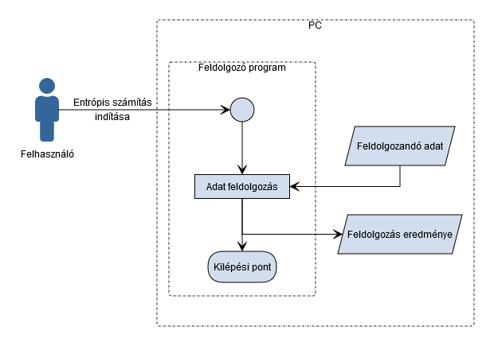
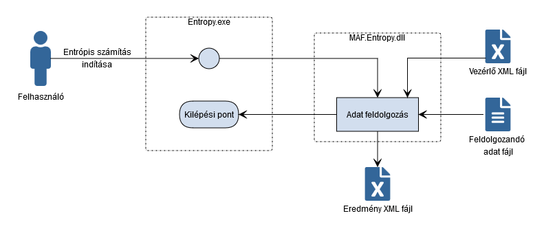

# Rendszerjavaslat

Általános javaslatok:
- Konzolos alkalmazás.
- Bemenő paraméterben megadva az adatfolyam.
- A feldolgozás paraméterei egy xml paraméter fájlban vannak. Ez vezérli a feldolgozást.

Rendszer javaslat diagram:

A rendszer komponensei:
- [Entropy.exe](../SRC/Product/MAF.Entropy.Console): futtatható állomány. A felület valósítja meg.
- [MAF.Entropy.dll](../SRC/Library/MAF.Entropy): Üzleti logikát megvalósító könyvtár.

Adatfolyam javaslatok:
- A bemeneti adatfolyam egy megadott szöveges állomány.
- A kimeneti eredmények xml állományba kerülnek.

