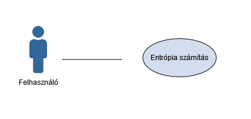

# Követelményspecifikáció

## Előszó

Az induló projekt egy tanulmányprogram megvalósítására irányul, ahol a későbbiekben cél lehet az elkészült program értékesítése.

## Jelen projekt célja

A tanulmány projekt célja, adott szövegből entrópia számítás elvégzése és az eredmények kiértékelhető formába való eltárolása. Az entrópia számításban a jelkészlet a nyers szövegben előforduló karakterek.

A cél megvalósítása érdekében szükséges egy entrópia számító alkalmazás elkészítése, mely adott szöveges bemenetre elkészíti a kiértékelhető eredményeket.

## Fogalomtár

- Bemenet: olyan adatfolyam, mely kizárólag az információt hordozza, vagyis nem tartalmaz például a megjelenítés számára vezérlő, illetve formázó karaktereket, csak és kizárólag azt a nyers információt tartalmazza, amire az entrópiát ki akarjuk számolni.
- Entrópia számítás: lásd: Bevezetés az informatikába[1] könyv "2.5. Az entrópia és tulajdonságai" alfejezetében található definíció.
- Jel: reguláris kifejezéssel megadott minták, például az egyes karakterek, szavak, stb.
- Entrópia számító program: A bemenet alapján a kimenetet előállító program. A továbbiakban a neve: TextAnalytics.
- Kimenet: az entrópia számítás részletes eredménye, kiértékelhető formában.

## Felhasználói követelmények

A felhasználó legyen képes egy az információkat tartalmazó adatfolyam megadásával az entrópia számítást úgy elvégezni, hogy az eredményeket könnyen értelmezhető formában, a feldolgozás lefutása után azonnal megkapja.

A felhasználói követelmény használati eset (use case) diagrammja:

További követelmények:
- hatékonyság: a bemenet függvényében minél kisebb processzor, memória és háttértár terhelés. A program, amennyire lehetséges sebességre optimalizált legyen.
- megbízhatóság: rendeltetésszerű használat esetén nem fordul elő hiba. Hibás vagy nem létező bemeneti adatfolyam esetén a megfelelő hibaüzenettel álljon le a program.
- hordozhatóság: támogatott Windows környezetben futó alkalmazás szükséges.
- környezeti követelmény: támogatott Windows környezetben futtatható legyen. Függőséget a program ne tartalmazzon, pl. ne épüljön rá más külső szoftverekre.
- működési követelmény: a program külső paraméterekkel legyen vezérelhető, interakciókat ne tartalmazzon.

## Fejlesztői követelmények

- A fejlesztésnél rétegtechnológia alkalmazása kötelező. Jelen program 2 rétegből kell felépüljön, felület és üzleti logika réteg.
- Kódkonvencióként a felhasznált programozási nyelvhez általánosan elfogadott kódolási konvenciókat kell alkalmazni.
- Törekedni kell az OOP szabályainak betartására valamint az általános alapelvek, mint a GOF és SOLID elvek betartására.

## Irodalomjegyzék
|1| Dr. Kovács Emőd, Bíró Csaba, Dr. Perge Imre: Bevezetés az informatikába, Eger, 2013, Eszterházy Károly Főiskola-Matematikai és Informatikai Intézet