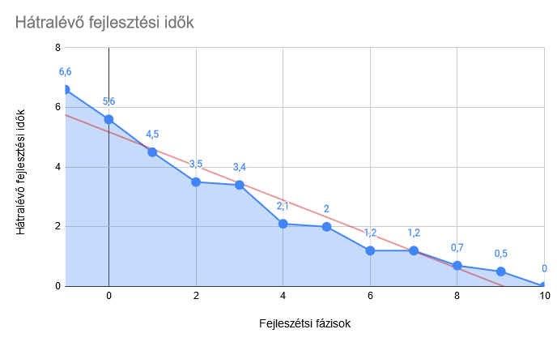

# Ütemterv és költségkalkuláció 

| Feladat                                            | Prioritás | Becslés (óra) | Munkakör          | Munkadíj/óra | Munkadíj | 
|----------------------------------------------------|-----------|---------------|-------------------|--------------|----------| 
| Munkakörnyezet kialakítása (hardver, szoftver)     | -1        | 1             | rendszergazda     | 30           | 30       | 
| ÜL kiszolgáló interfész tervezése                  | 0         | 0,5           | szenior fejlesztő | 40           | 20       | 
| Vezérlő XML fájl felépítésének tervezése           | 0         | 0,3           | szenior fejlesztő | 40           | 12       | 
| Eredmény XML fájl felépítésének tervezése          | 0         | 0,3           | szenior fejlesztő | 40           | 12       | 
| Adat feldolgozó megtervezése (Entrópia számítás)   | 1         | 1             | szenior fejlesztő | 40           | 40       | 
| ÜL projket létrehozáas                             | 2         | 0,1           | junior fejlesztő  | 30           | 3        | 
| ÜL interfész megvalósítása                         | 3         | 0,2           | junior fejlesztő  | 30           | 6        | 
| Vezérlő XML fájl kezelő megvalósítása              | 3         | 0,3           | junior fejlesztő  | 30           | 9        | 
| Eredmény XML fájl kezelő megvalósítása             | 3         | 0,3           | junior fejlesztő  | 30           | 9        | 
| Adat feldolgozó megvalósítása                      | 3         | 0,5           | junior fejlesztő  | 30           | 15       | 
| Felület projekt létrehozása                        | 4         | 0,1           | junior fejlesztő  | 30           | 3        | 
| Felület projekt súgó funkció megírása              | 5         | 0,5           | junior fejlesztő  | 30           | 15       | 
| Felület projekt paraméter feldolgozó megvalósítása | 5         | 0,2           | junior fejlesztő  | 30           | 6        | 
| Felület projekt ÜL implementálása                  | 5         | 0,1           | junior fejlesztő  | 30           | 3        | 
| Felhasználói dokumentáció megírása                 | 6         | 0             | junior fejlesztő  | 30           | 0        | 
| Rendszer tesztelés                                 | 7         | 0,5           | tesztelő          | 30           | 15       | 
| Tesztelés utáni javítás                            | 8         | 0,21          | szenior fejlesztő | 40           | 8,4      | 
| Tesztelés utáni javítás és újratesztelés           | 9         | 0,5           | tesztelő          | 30           | 15       | 
|                                                    |           | 6,61          |                   |              | 221,4    |

Használt rövidítések:
- ÜL : üzleti logika

